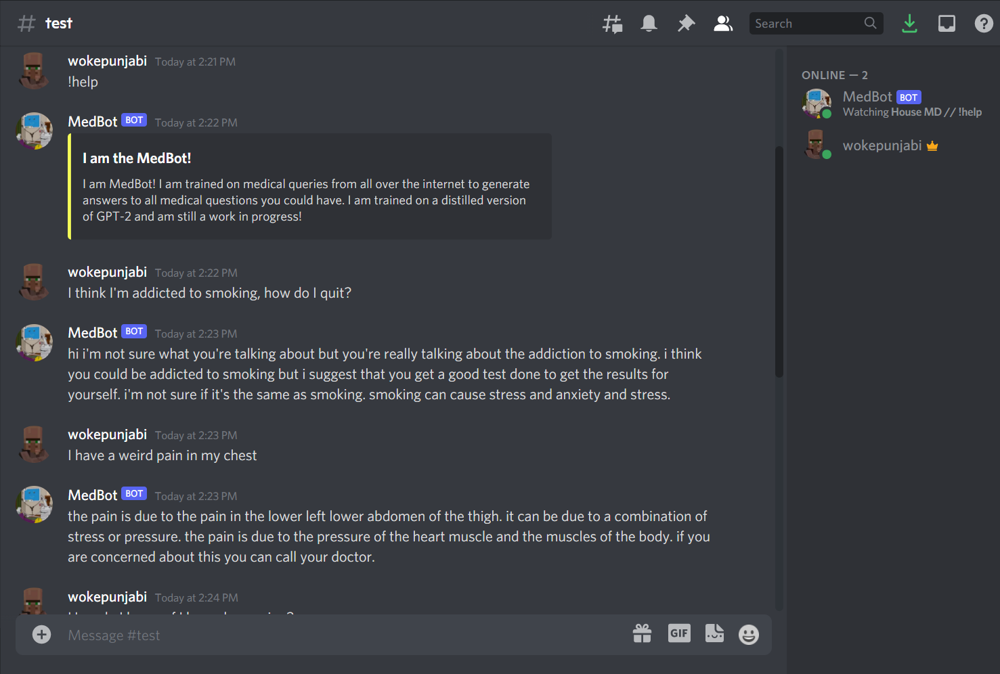
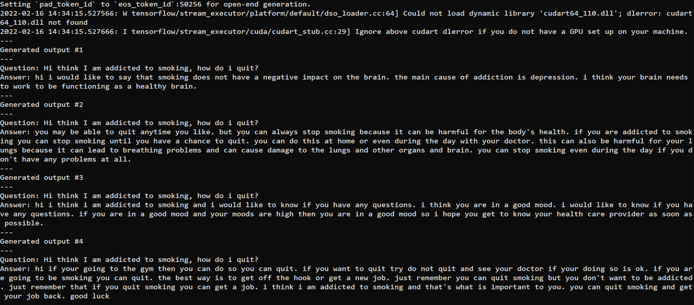

# MedBot

MedBot is a medical smart chatbot which uses NLG to answer user medical queries. It is made on top of a distilled version of **[GPT-2](https://openai.com/blog/better-language-models/)** by using the **[HuggingFace Repository](https://huggingface.co/)**. The bot is trained on medical queries gathered from websites such as WebMD and questionDoctor. MedBot has been trained on roughly 45,000 total back-and-forth conversations. MedBot is a step above an average conversational chabot as it generates its own replies just by reading what the user says to it. This bot is a step taken in my thesis research in the field of NLP and NLG.

MedBot implements a part of natural language processing called **NLG**, which is Natural Language Generation. As opposed to the conventional method where the bot looks into a text file with pre-stored replies for a set of expected questions, The bot generates its own replies based on the context of the question asked by the user.

The code is split into the following scripts:
* **preprocessing.ipybn**
* **run_experiments.sh**
* **model_generator.py**
* **medbot.py**

 The first, **preprocessing.ipybn**,  file reads the data gathered from the Topical-Chat repository and converts it into a form readable by our distilled GPT-2 model in a file called. Further, the program reads the intermediate data from this file and splits it into training and test data.

 ~~~python
#preprocessing.ipybn
df = pd.DataFrame()
questions, answers = [], []

for dataset in datasets:
  data = json.load(open(dataset, 'r'))
  for i in data['pairs']:
    questions.append(i['question'])
    answers.append(i['answer'])
df['questions'] = questions
df['answers'] = answers

df['train_param'] = '\nQuestion: ' + df.questions + '\nAnswer: ' + df.answers + special_token

dataset_train = df[:29000].train_param.values
dataset_val = df[29000:].train_param.values
with open('Dataset/dataset_train.txt', 'w') as f:
  f.write('\n'.join(dataset_train))

with open('Dataset/dataset_val.txt', 'w') as f:
  f.write('\n'.join(dataset_val))
 ~~~

 Using **Google Colab**, the same file makes use of the **[transformers](https://github.com/huggingface/transformers)** package made available by HuggingFace. This part loads in a distilled version of GPT-2 and instructs to train it on the dataset provided by us.

 ~~~python
 !git clone https://github.com/huggingface/transformers;
 !cd transformers; pip3 install .
 #The distilled gpt-2 model comes from the huggingface repository using the transformers library.
 #This section of the code imports transformers.

 !bash run_experiments.sh
 #The following bash file trains the model over 1 epochs and makes checkpoints every 500 steps.
 ~~~

 Upon this, the **run_experiments.sh** file is executed which trains the model over 4 epochs. This, and **run_lm_finetuning.py** are default codes provided by HuggingFace to aid in model training.

~~~bash
#run_experiments.sh

mkdir experiments
for epoch in 1
do
 python run_lm_finetuning.py \
 --model_name_or_path distilgpt2 \
 --model_type gpt2 \
 --train_data_file /content/Dataset/dataset_train.txt \
 --output_dir experiments/epochs_$epoch \
 --do_train \
 --per_device_train_batch_size 2 \
 --overwrite_output_dir \
 --num_train_epochs $epoch
done
~~~

This creates our final trained model which is stored in **Models/epochs_1/**. The next file, **model_generator.py** uses the transformers package on this dataset to implement the model for our purposes.

~~~python
#model_generator.py

class Generator:
    def get_reply(user_input):
        prompt_text = f'Question: {user_input}\nAnswer:'
        encoded_prompt = tokenizer.encode(prompt_text,
                                  add_special_tokens = False,
                                  return_tensors = 'pt')

        output_sequences = model.generate(
            input_ids = encoded_prompt,
            max_length = 500,
            temperature = 0.9,
            top_k = 20,
            top_p = 0.9,
            repetition_penalty = 1,
            do_sample = True,
            num_return_sequences = 4
        )

        result = tokenizer.decode(random.choice(output_sequences))
        result = result[result.index("Answer: "):result.index(special_token)]
        return(result[8:])
~~~

An output for any given query is generated by the function **get_reply()** which takes in anything said by the user. With this, the bot can easily now generate replies for anything asked by the user. The last file, **villager.py** hosts the bot on **Discord** for conversations. It imports the model from model_generator and supplies it user queries using the discord API. It also creates a file, **Logs.txt** which stores every conversation had by the bot and the user.

~~~python
#constantly runs, takes messages from the user and responds using the provided dataset
@client.event
async def on_message(message):
    msg = message.content.strip()
    reply = Generator.get_reply(msg.strip())
    if message.author == client.user:
        return

    if message.content.startswith(msg) and not message.content.startswith('!'):
        await message.channel.send(reply)
    await client.process_commands(message)

    #a log of every conversation is recorded on Logs.txt
    with open('Logs.txt', 'a', encoding = "UTF-8") as f:
        f.write(f'User: {msg}\nVillager#9524: {reply}\n')
~~~

~~~text
User: I think I'm addicted to smoking, how do I quit?
MedBot: hi i'm not sure what you're talking about but you're really talking about the addiction to smoking. i think you could be addicted to smoking but i suggest that you get a good test done to get the results for yourself. i'm not sure if it's the same as smoking. smoking can cause stress and anxiety and stress.
User: I have a weird pain in my chest
MedBot: the pain is due to the pain in the lower left lower abdomen of the thigh. it can be due to a combination of stress or pressure. the pain is due to the pressure of the heart muscle and the muscles of the body. if you are concerned about this you can call your doctor.
User: How do I know of I have depression?
MedBot: you can check with your healthcare provider to get an answer. if you are having a history of depression and have not had it before and you may have experienced a number of other symptoms in your life. if you have not had it before and you have not had it then you should get you a proper medical history and/or the treatment that you need.
User: How do I know if I have thyroid?
MedBot: thyroid is a hormone that is produced from the thyroid gland. in fact it is important that the thyroid gland is protected. if you are having a seizure or have an underlying medical condition such as diabetes or thyroid disease your doctor may be able to make a determination on the cause of your seizure and make a diagnosis. if you are having a seizure or have an underlying medical condition such as diabetes or thyroid disease you should contact your doctor.
User: I have a weird pain in my throat
MedBot: i think you should see a neurologist to see if you can have a problem. the first step in diagnosing a specific medical problem is a few simple tests. there is no need for a neurologist to diagnose a specific medical problem. a few things to consider include:
User: How do I know if I have thyroid?
MedBot: hi you can try this one. its a thyroid hormone but it is a hormone that is produced by your thyroid gland that is called your thyroid gland and is called your thyroid hormone. this is the way in which you get your body's natural hormone hormones that are released through your body to help your body maintain normal function and function. if your thyroid hormone is in the wrong place try to get the thyroid hormone removed to normal and it will not work. the reason for this is because of the thyroid hormone deficiency that can happen due to the thyroid hormone deficiency. the problem with this is that it is difficult for you to get enough thyroid hormone for your body to maintain proper function. so it is best to see your doctor.
~~~

While the bot is present on discord as a concise chatbot, I am still researching and improving the algorithm to make it make more sense in it's replies. The files **final.py** and **temp.py** are works in progress regarding the same.

To run the bot locally, the following dependencies and libraries are required:
* tensorflow
* PyTorch
* transformers (from HuggingFace)
* pandas
* discord

The **pytorch_model.bin** file containing the trained model isn't in the repository because of it's size. A link to download it is given in the **Models/epochs_1/model.txt** file. To run it locally, download the model and save it in the same directory. Alternatively, run the **model_train.ipybn** file on Google Colab and a downloadable model will be trained in roughly 1.5 hours.
